# BrickOptima 🚀

**BrickOptima** is an AI-powered observability and optimization platform for Databricks and Apache Spark workloads. It transforms raw, complex execution plans (DAGs) into interactive visualizations and provides actionable, code-level optimization suggestions using Google Gemini 2.0.


---

## 📑 Table of Contents

- [Key Features](#key-features)
- [🏗️ Project Architecture](#️-project-architecture)
- [🔄 Request Flow: End-to-End](#-request-flow-end-to-end)
- [💾 Caching Implementation](#-caching-implementation)
- [🧩 Component Deep Dive](#-component-deep-dive)
- [🚀 Getting Started](#-getting-started)
- [🛠️ Tech Stack](#️-tech-stack)

---

## Key Features

*   **Visual DAG Analysis**: Interactive D3.js visualization of Spark Physical Plans with bottleneck highlighting.
*   **AI Performance Consultant**: Chat with your execution plan using Gemini 2.0 Flash.
*   **Predictive Analytics**: Forecast performance at 10x/100x scale and detect regressions.
*   **Code Traceability**: Map execution plan nodes directly to your GitHub source code.
*   **Live Monitor**: Simulate real-time cluster telemetry (Throughput, GC, Shuffle).

---

## 🏗️ Project Architecture

The application follows a modern **Backend for Frontend (BFF)** pattern with clear separation of concerns.

```mermaid
graph TB
    subgraph "🖥️ Frontend (Port 3000)"
        UI[React Components<br/>App.tsx, EnhancedDagVisualizer]
        APIs[API Layer<br/>analysis.ts, chat.ts, auth.ts]
        Client[ApiClient<br/>client.ts]
        Vite[Vite Dev Server]
    end

    subgraph "⚙️ Backend (Port 3001)"
        Controllers[Controllers<br/>AnalysisController, ChatController, AuthController]
        Guards[Guards & Interceptors<br/>JwtAuthGuard, TransformInterceptor]
        Services[Services<br/>AnalysisService, ChatService, AuthService]
        Integrations[External Integrations<br/>GeminiService]
        Prisma[Prisma ORM]
    end

    subgraph "🗄️ Data Layer"
        DB[(SQLite Database)]
    end

    subgraph "🤖 AI Layer"
        Gemini[Google Gemini 2.0 Flash]
    end

    UI --> APIs
    APIs --> Client
    Client --> Vite
    Vite -->|Proxy /api/*| Controllers
    Controllers --> Guards
    Guards --> Controllers
    Controllers --> Services
    Services --> Integrations
    Services --> Prisma
    Prisma --> DB
    Integrations --> Gemini

    style UI fill:#e1f5fe
    style Services fill:#fff3e0
    style Gemini fill:#f3e5f5
    style DB fill:#e8f5e9
```



### Directory Structure

| Directory | Purpose |
|-----------|---------|
| `/frontend` | React 19 + Vite application with D3.js visualizations |
| `/backend` | NestJS REST API with Prisma ORM |
| `/shared` | TypeScript interfaces shared between frontend and backend |

---

## 🔄 Request Flow: End-to-End

This section details exactly how a user action flows through every component of the system.

### Example: Analyzing a Spark Execution Plan


### Step-by-Step Breakdown

| Step | Component | Action |
|------|-----------|--------|
| **1-3** | Frontend | User interaction triggers `analysisApi.create()` which wraps the `ApiClient` |
| **4** | ApiClient | Attaches `Authorization: Bearer <token>` header from localStorage |
| **5** | Vite Proxy | Rewrites `/api/*` requests to `http://localhost:3001/api/v1/*` |
| **6-8** | JwtAuthGuard | Validates JWT using Passport strategy, extracts user from token |
| **9** | Controller | Delegates to `AnalysisService.create()` with authenticated user ID |
| **10-12** | Cache Layer | Generates SHA-256 hash and checks for existing analysis |
| **13-17** | Service | Returns cached result OR creates new record with `PROCESSING` status |
| **18-22** | GeminiService | Constructs prompt, calls Gemini API, parses and repairs response |
| **23-24** | Persistence | Updates analysis with results and increments user's `analysisCount` |
| **25-27** | Polling | Frontend polls `/analyses/:id/status` until `COMPLETED` |

---

## 💾 Caching Implementation

BrickOptima implements an intelligent **content-based caching strategy** to avoid redundant AI calls.

### How It Works

```mermaid
flowchart TD
    A[Incoming Analysis Request] --> B[Generate SHA-256 Hash]
    B --> C{Check Database}
    
    C -->|Hash Found<br/>+ Status: COMPLETED<br/>+ Created < 24h ago| D[🎯 Cache HIT]
    C -->|No Match| E[❌ Cache MISS]
    
    D --> F[Return Cached Result]
    E --> G[Create New Analysis]
    G --> H[Call Gemini API]
    H --> I[Store Result with Hash]
    
    style D fill:#c8e6c9
    style E fill:#ffcdd2
    style F fill:#e8f5e9
```



### Cache Key Generation

```typescript
// backend/src/modules/analysis/analysis.service.ts
const inputHash = createHash('sha256').update(dto.content).digest('hex');
```

### Cache Lookup Logic

```typescript
// Check for existing analysis with same content (cache hit)
const existing = await this.prisma.analysis.findFirst({
  where: {
    userId,           // User-specific cache
    inputHash,        // Content-based key
    status: 'COMPLETED',  // Only completed analyses
    createdAt: {
      gte: new Date(Date.now() - 24 * 60 * 60 * 1000), // Last 24 hours
    },
  },
});

if (existing) {
  this.logger.log(`Cache hit for analysis: ${existing.id}`);
  return existing;  // Return cached result immediately
}
```

### Cache Characteristics

| Property | Value |
|----------|-------|
| **Key** | SHA-256 hash of input content |
| **Scope** | Per-user (different users can cache same content) |
| **TTL** | 24 hours |
| **Invalidation** | Automatic via timestamp check |
| **Storage** | SQLite database (via Prisma) |

### Benefits

1. **Cost Savings**: Avoid redundant Gemini API calls
2. **Faster Response**: Cached results return immediately
3. **User Privacy**: Each user has their own cache namespace
4. **Automatic Expiry**: Old caches are naturally filtered out

---

## 🧩 Component Deep Dive

### Frontend Components

#### 🔌 API Layer (`/frontend/api/`)

| File | Purpose |
|------|---------|
| [`client.ts`](frontend/api/client.ts) | Base HTTP client with JWT handling and auto-refresh |
| [`analysis.ts`](frontend/api/analysis.ts) | Analysis CRUD operations |
| [`chat.ts`](frontend/api/chat.ts) | AI chat session management |
| [`auth.ts`](frontend/api/auth.ts) | Authentication (login, register, refresh) |

**ApiClient Features:**
- Automatic `Authorization` header injection
- Token refresh on 401 response
- Request queuing during refresh

```typescript
// Automatic token refresh flow
if (response.status === 401 && this.accessToken) {
  const newToken = await this.refreshAccessToken();
  if (newToken) {
    // Retry original request with new token
    response = await fetch(url, { ...options, headers });
  }
}
```

#### 🎨 UI Components (`/frontend/components/`)

| Component | Description |
|-----------|-------------|
| `EnhancedDagVisualizer.tsx` | D3.js-powered DAG visualization with animations |
| `ChatInterface.tsx` | AI consultant chat interface |
| `OptimizationList.tsx` | Displays optimization recommendations |
| `CostEstimator.tsx` | Cloud cost estimation calculator |
| `LiveMonitor.tsx` | Real-time telemetry simulation |
| `PredictivePanel.tsx` | What-if scenario analysis |

---

### Backend Components

#### 📡 Controllers (`/backend/src/modules/`)

| Controller | Endpoints | Purpose |
|------------|-----------|---------|
| `AnalysisController` | `/api/v1/analyses/*` | DAG analysis CRUD |
| `ChatController` | `/api/v1/chat/*` | AI chat sessions |
| `AuthController` | `/api/v1/auth/*` | Authentication flows |

#### 🔒 Guards & Interceptors (`/backend/src/common/`)


| Component | Purpose |
|-----------|---------|
| `JwtAuthGuard` | Validates JWT tokens on protected routes |
| `TransformInterceptor` | Wraps all responses in `{ success, data, timestamp }` |
| `LoggingInterceptor` | Request/response logging for debugging |

#### ⚙️ Services (`/backend/src/modules/`)

| Service | Responsibilities |
|---------|------------------|
| `AnalysisService` | Caching, Prisma operations, async processing |
| `ChatService` | Conversation management, context building |
| `AuthService` | Password hashing, JWT/refresh token generation |

#### 🤖 Integrations (`/backend/src/integrations/`)

| Service | Purpose |
|---------|---------|
| `GeminiService` | Gemini API client, prompt engineering, response parsing, DAG repair |

**GeminiService Capabilities:**
- Structured prompt with TypeScript interface
- JSON response parsing with cleanup
- Automatic DAG connectivity repair (orphan node detection)

---

### Shared Types (`/shared/types.ts`)

Type-safe contracts between frontend and backend:

| Type | Purpose |
|------|---------|
| `AnalysisResult` | Complete analysis response structure |
| `DagNode`, `DagLink` | DAG visualization data |
| `OptimizationTip` | Optimization recommendations |
| `ChatMessage` | Chat history structure |
| `PerformancePrediction` | What-if scenario results |

---

## 🚀 Getting Started

### Prerequisites
*   Node.js (v18+)
*   npm or pnpm
*   Google Gemini API Key

### Installation

1.  **Clone the repository**
    ```bash
    git clone https://github.com/Dharmik2510/databricks-plan-optimizer.git
    cd databricks-plan-optimizer
    ```

2.  **Install Dependencies**
    ```bash
    npm install
    cd backend && npm install
    cd ../frontend && npm install
    ```

3.  **Environment Setup**
    Create a `.env` file in the root and/or backend directory with:
    ```env
    GEMINI_API_KEY=your_key_here
    DATABASE_URL="file:./dev.db"
    JWT_SECRET=your_secret
    ```

4.  **Run the Application**
    To run both Frontend and Backend concurrently:
    ```bash
    npm run dev:all
    ```
    *   Frontend: `http://localhost:3000`
    *   Backend: `http://localhost:3001`

---

## 🛠️ Tech Stack

| Layer | Technologies |
|-------|-------------|
| **Frontend** | React 19, TypeScript, Vite, D3.js, Recharts, Lucide React |
| **Backend** | NestJS, Prisma, Passport (JWT Auth), bcrypt |
| **AI** | Google GenAI SDK (Gemini 2.0 Flash) |
| **Database** | SQLite (development), PostgreSQL (production ready) |
| **Proxy** | Vite dev server with API proxying |

---

## 🚀 CI/CD & Deployment

BrickOptima uses GitHub Actions for automated versioning, building, and deployment to Google Cloud Run.

### Pipeline Overview


### Workflows

| Workflow | Trigger | Purpose |
|----------|---------|---------|
| `ci.yml` | PR & Push to main | Lint, test, and validate Docker builds |
| `release.yml` | Push to main | Semantic versioning with conventional commits |
| `deploy.yml` | New release | Build, push, and deploy to Cloud Run |

### Versioning

We use [Conventional Commits](https://www.conventionalcommits.org/) for automated versioning:

| Commit Prefix | Version Bump | Example |
|---------------|--------------|---------|
| `feat:` | Minor (1.0.0 → 1.1.0) | `feat: add cost estimator` |
| `fix:` | Patch (1.0.0 → 1.0.1) | `fix: resolve cache issue` |
| `feat!:` or `BREAKING CHANGE:` | Major (1.0.0 → 2.0.0) | `feat!: redesign API` |

### Required GitHub Secrets

| Secret | Description |
|--------|-------------|
| `GCP_SA_KEY` | Google Cloud service account key JSON |
| `DATABASE_URL` | Supabase PostgreSQL connection string |

### GCP Secret Manager

Sensitive runtime secrets are stored in Google Cloud Secret Manager:
- `database-url` - PostgreSQL connection string
- `jwt-secret` - JWT signing key
- `gemini-api-key` - Google AI API key

📖 See [GCP Secrets Setup Guide](./docs/gcp-secrets-setup.md) for detailed instructions.

---

## 📄 Additional Documentation

- [Architecture Deep Dive](./ARCHITECTURE.md)
- [Features Overview](./FEATURES.md)
- [GCP Secrets Setup](./docs/gcp-secrets-setup.md)

---

<p align="center">
  Built with ❤️ for the Spark community
</p>
