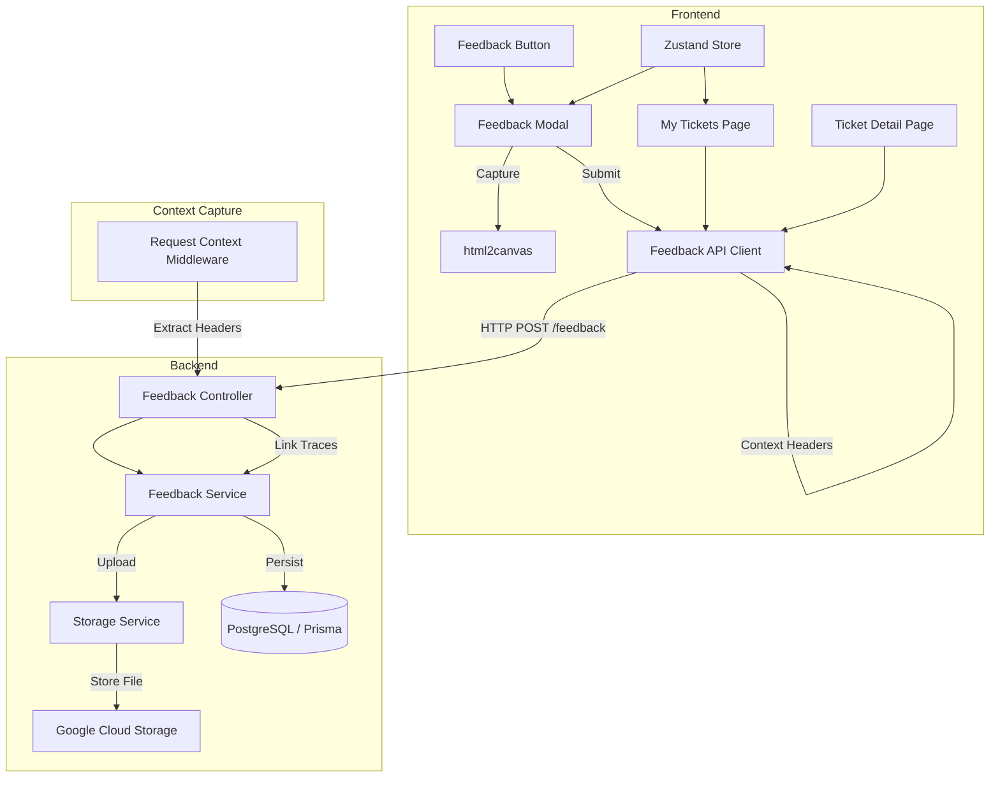

# Phase 3: User Feedback System Architecture

## Overview
The User Feedback System allows users to submit issue reports and feature requests directly from the application interface. It includes context auto-capture (logs, traces, session info) to aid debugging and supports screenshot uploads via Google Cloud Storage (GCS).

## Architecture

## Key Components

### Frontend

1.  **Feedback Components**
    *   `FeedbackButton`: Floating action button that triggers the modal.
    *   `FeedbackModal`: Form for submitting feedback with category, severity, and description.
    *   `FeedbackMyTickets`: Page for users to view and filter their submitted tickets.
    *   `FeedbackDetail`: Detailed view of a ticket including conversation history and attachments.

2.  **State Management**
    *   `useFeedbackStore`: Zustand store managing modal visibility, context data, and selected ticket state.

3.  **Context Capture**
    *   **Screenshot**: Uses `html2canvas` to capture the current DOM state as a base64 image.
    *   **Metadata**: Automatically captures `userAgent`, `pageUrl`, `appVersion`, and `lastAction`.
    *   **Trace Context**: `ApiClient` injects `X-Correlation-ID`, `X-Session-ID`, and `traceparent` headers to link feedback to backend logs.

### Backend

1.  **Feedback Module** (`/modules/feedback`)
    *   `FeedbackController`: Handles REST endpoints for creation, retrieval, and replies.
    *   `FeedbackService`: Orchestrates data persistence and business logic.
    *   `StorageService`: Abstraction for file storage. Uses **Google Cloud Storage** in production and falls back to **Base64** storage for local/dev environments.

2.  **Data Model**
    *   `UserFeedback`: Core entity storing ticket details and context metadata.
    *   `FeedbackEvent`: Audit log of actions (creation, replies, status changes).
    *   `FeedbackAttachment`: Stores file metadata and storage URLs (supporting both `gs://` and `base64://` schemes).

## Integration Points

*   **Observability**: The system integrates with the `RequestContextMiddleware` to ensuring every feedback ticket is linked to the distributed trace ID of the user's session.
*   **Authentication**: Uses the standard `JwtAuthGuard` to ensure only authenticated users can submit and view feedback.
*   **Permissions**: Enforces strict ownership checks; users can only view and reply to their own tickets.

## Storage Strategy

*   **Screenshots**: 
    *   Production: Uploaded to GCS bucket defined by `GCS_FEEDBACK_BUCKET`.
    *   Development: Stored as base64 strings if GCS credentials are missing.
*   **Access Control**: Signed URLs are generated on read for secure access to GCS objects.

## Future Enhancements
*   Admin dashboard for ticket management.
*   Email notifications for ticket updates.
*   Integration with external issue trackers (Jira/GitHub).
