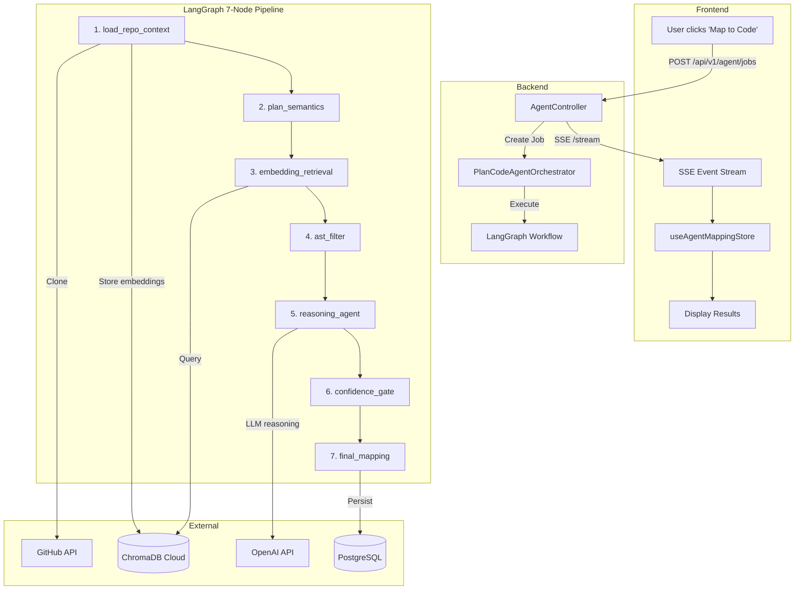
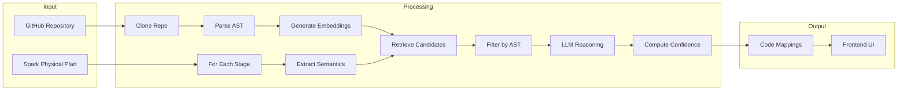
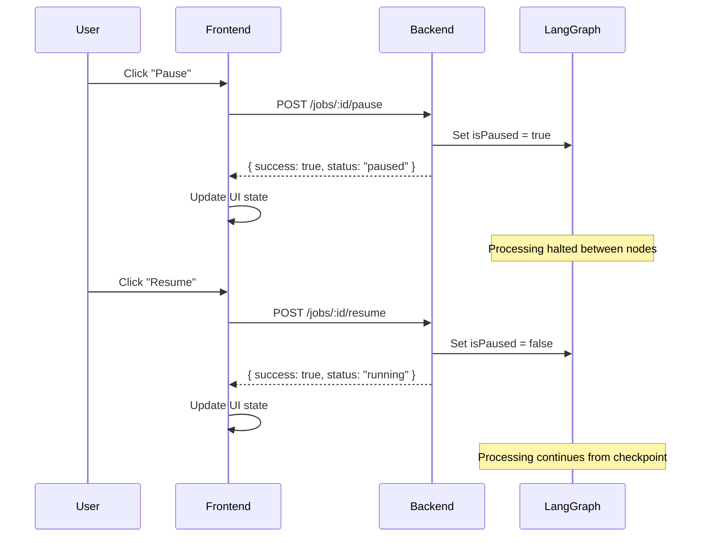

# Map to Code Agent

> **Production-grade LangGraph-powered system for mapping Databricks Spark physical plan DAG nodes to source code.**

---

## Overview

When a user clicks **"Map to Code"** in the BrickOptima UI, this system:

1. Clones the user's GitHub repository
2. Parses source code using AST analysis
3. Generates embeddings for code symbols (functions/classes)
4. For each DAG node in the physical plan:
   - Extracts execution semantics (groupBy, filter, join, etc.)
   - Retrieves candidate code via semantic similarity (ChromaDB)
   - Filters candidates by structural compatibility (AST)
   - Uses LLM reasoning to compare semantics vs. code behavior
   - Computes confidence score
5. Returns mappings with explanations and alternatives

---

## Architecture



---

## LangGraph Workflow

The mapping pipeline consists of 7 sequential nodes that process each DAG node through a multi-stage confidence-building pipeline.

### Execution Timeline

```mermaid
gantt
    title DAG Node Mapping Timeline (per node)
    dateFormat ss
    axisFormat %S s
    
    section Repository
    load_repo_context       :done, repo, 00, 45s
    
    section Per-Node Pipeline
    plan_semantics          :active, sem, 45, 1s
    embedding_retrieval     :ret, after sem, 2s
    ast_filter              :ast, after ret, 1s
    reasoning_agent         :llm, after ast, 3s
    confidence_gate         :conf, after llm, 1s
    final_mapping           :final, after conf, 1s
```



---

### State Schema

The LangGraph state tracks all pipeline data:

```typescript
// backend/src/modules/agent/langgraph/state/mapping-state.schema.ts

interface MappingState {
  // Job metadata
  jobId: string;
  repoUrl: string;
  repoCommitHash: string | null;
  analysisId: string;

  // Repository context (cached)
  repoContext: {
    clonePath: string;
    commitHash: string;
    cacheKey: string;
    fileCount: number;
    embeddingsGenerated: number;
    astIndexSize: number;
  } | null;

  // DAG processing
  dagNodes: DagNode[];
  currentNodeIndex: number;
  currentDagNode: DagNode | null;

  // Pipeline outputs
  semanticDescription: SemanticDescription | null;
  retrievedCandidates: Candidate[];
  filteredCandidates: Candidate[];
  finalMapping: CodeMapping | null;

  // Results
  confidence: number;
  explanation: string;
  alternatives: Alternative[];
  completedMappings: MappingOutput[];

  // Job state
  status: 'pending' | 'running' | 'paused' | 'completed' | 'failed';
  error: string | null;
}
```

---

### Node 1: `load_repo_context`

**Purpose:** Clone repository, parse AST, generate embeddings

**Location:** `backend/src/modules/agent/langgraph/nodes/load-repo-context.node.ts`

| Input | Output |
|-------|--------|
| `repoUrl`, `commitHash` | `repoContext` with `clonePath`, `embeddings`, `astIndex` |

**Process:**
1. Check cache by `cacheKey = SHA-256(repoUrl + commitHash)`
2. Clone repo (with `GITHUB_TOKEN` for private repos)
3. Scan `.py`, `.scala`, `.java` files
4. Run AST parser to extract functions, classes, Spark operations
5. Generate embeddings using `text-embedding-3-small` (batch of 100)
6. Store in ChromaDB collection: `codebase_functions`

**Code Preview:**
```typescript
async function loadRepoContextNode(state: MappingState): Promise<Partial<MappingState>> {
  // Check cache first
  const cacheKey = generateCacheKey(state.repoUrl, state.repoCommitHash);
  const cached = await checkRepoCache(cacheKey);
  if (cached) return { repoContext: cached };

  // Clone and analyze
  const clonePath = await cloneRepository(state.repoUrl, state.repoCommitHash);
  const { files, astIndex } = await parseAST(clonePath);
  const embeddings = await generateEmbeddings(files);
  await storeInChromaDB(embeddings, cacheKey);

  return { repoContext: { clonePath, cacheKey, ...stats } };
}
```

---

### Node 2: `plan_semantics`

**Purpose:** Extract execution semantics from DAG node

**Location:** `backend/src/modules/agent/langgraph/nodes/plan-semantics.node.ts`

| Input | Output |
|-------|--------|
| `currentDagNode` | `semanticDescription` |

**Operator Behavior Map:**

| Spark Operator | Semantic Description |
|----------------|---------------------|
| `HashAggregate` | Groups data by keys and applies aggregate functions |
| `Filter` | Filters rows based on predicate expression |
| `BroadcastHashJoin` | Joins datasets using broadcast strategy for smaller table |
| `SortMergeJoin` | Joins large datasets using sort-merge algorithm |
| `Project` | Selects and transforms columns |
| `Exchange` | Shuffles data across partitions (generated by Spark) |
| `Sort` | Orders data by specified columns |
| `Window` | Applies window functions over partitions |

**Output Structure:**
```typescript
interface SemanticDescription {
  dagNodeId: string;
  operatorType: string;
  executionBehavior: string;  // Human-readable description
  dataTransformation: {
    inputColumns: string[];
    outputColumns: string[];
    keyColumns: string[];
    aggregateFunctions: string[];
    filterConditions: string[];
  };
  sparkOperatorSignature: string;  // For embedding query
}
```

---

### Node 3: `embedding_retrieval`

**Purpose:** Find code candidates using semantic similarity

**Location:** `backend/src/modules/agent/langgraph/nodes/embedding-retrieval.node.ts`

| Input | Output |
|-------|--------|
| `semanticDescription`, `repoContext` | `retrievedCandidates[]` (top-K) |

**Process:**
1. Embed `sparkOperatorSignature` using `text-embedding-3-small`
2. Query ChromaDB with vector similarity search (L2 distance)
3. Convert distance to similarity: `similarity = 1 - (distance / 2)`
4. Filter by `metadata.type IN ['function', 'method']`
5. Return top-K candidates (default: 10)

**Candidate Structure:**
```typescript
interface Candidate {
  file: string;
  symbol: string;
  lines: string;
  codeSnippet: string;
  embeddingScore: number;  // 0-1 similarity
  metadata: {
    type: 'function' | 'class' | 'method';
    sparkOps: string[];
    columns: string[];
  };
}
```

---

### Node 4: `ast_filter`

**Purpose:** Remove structurally incompatible candidates using AST rules

**Location:** `backend/src/modules/agent/langgraph/nodes/ast-filter.node.ts`

| Input | Output |
|-------|--------|
| `retrievedCandidates` | `filteredCandidates[]` with `astScore` |

**Operator-Specific Rules:**

| Operator | Required Code Patterns |
|----------|----------------------|
| `HashAggregate` | `groupBy()`, `agg()`, `count()`, `sum()`, `avg()` |
| `Filter` | `filter()`, `where()`, boolean expressions |
| `Join` | `join()`, `leftJoin()`, `rightJoin()`, key columns |
| `Sort` | `orderBy()`, `sort()` |
| `Window` | `over()`, `partitionBy()`, `rowNumber()` |

**Exclusion Patterns:**
- Utility functions: `_helper()`, `log()`, `utils.*`
- Test code: File path contains `test/` or `_test.py`
- Dead code: No callers in call graph

**Scoring:**
```
astScore = (operatorMatch * 0.5) + (semanticVerbMatch * 0.3) + (notExcluded * 0.2)
```

---

### Node 5: `reasoning_agent`

**Purpose:** LLM compares execution semantics vs code behavior

**Location:** `backend/src/modules/agent/langgraph/nodes/reasoning-agent.node.ts`

| Input | Output |
|-------|--------|
| `filteredCandidates` (top 3) | `finalMapping`, `explanation`, `alternatives` |

**LLM Prompt Template:**
```
You are analyzing a Spark physical plan operator and must map it to source code.

OPERATOR SEMANTICS:
{semanticDescription.executionBehavior}

PHYSICAL PLAN FRAGMENT:
{physicalPlanFragment}

CANDIDATE CODE:
[1] File: {file}, Function: {symbol}
{codeSnippet}

[2] ...

TASK:
1. Compare the OPERATOR SEMANTICS to each CANDIDATE CODE
2. Select the code that MOST LIKELY implements this operator's behavior
3. Explain WHY this code matches the operator

OUTPUT (JSON):
{
  "bestMatchIndex": 1,
  "reasoning": "...",
  "confidenceLevel": "definite|likely|possible|unlikely"
}
```

**Configuration:**
- Model: `gpt-4o`
- Temperature: `0.1` (deterministic)
- Max tokens: `1000`

---

### Node 6: `confidence_gate`

**Purpose:** Compute multi-factor confidence score and route

**Location:** `backend/src/modules/agent/langgraph/nodes/confidence-gate.node.ts`

**Formula:**
```typescript
const confidence = 
  embeddingScore * 0.30 +     // Semantic similarity
  astScore * 0.20 +           // Structural compatibility
  llmConfidence * 0.40 +      // Reasoning quality
  keywordMatch * 0.10 -       // Term overlap
  alternativesPenalty;        // -0.1 if alternatives exist
```

**LLM Confidence Extraction:**

| LLM Response | Confidence Value |
|--------------|-----------------|
| "definitely", "clearly" | 0.90 |
| "likely", "probably" | 0.70 |
| "possibly", "might" | 0.50 |
| "unsure", "unclear" | 0.30 |

**Routing:**
- `≥ 0.75` → **Confirmed** (green badge)
- `0.50 - 0.74` → **Probable** (yellow badge)
- `< 0.50` → **Uncertain** (gray badge)

---

### Node 7: `final_mapping`

**Purpose:** Persist results and emit SSE events

**Location:** `backend/src/modules/agent/langgraph/nodes/final-mapping.node.ts`

**Actions:**
1. Build final output structure
2. Persist to PostgreSQL (`code_mappings` table)
3. Emit `mapping_finalized` SSE event
4. Append to `completedMappings` array

**Output Structure:**
```typescript
interface MappingOutput {
  dagNodeId: string;
  mappedCode: {
    file: string;
    symbol: string;
    lines: string;
    codeSnippet: string;
  };
  confidence: number;
  confidenceStatus: 'confirmed' | 'probable' | 'uncertain';
  confidenceFactors: {
    embeddingScore: number;
    astScore: number;
    llmConfidence: number;
    keywordMatch: number;
  };
  explanation: string;
  alternatives: Alternative[];
}
```

---

## Data Flow Diagram



---


## API Reference

Base path: `/api/v1/agent`

### Create Job

```http
POST /api/v1/agent/jobs
Authorization: Bearer <token>
Content-Type: application/json

{
  "repositoryUrl": "https://github.com/user/repo",
  "branch": "main",
  "token": "ghp_...",           // Optional: for private repos
  "planContent": "== Physical Plan ==\n...",
  "dagStages": [...]
}

Response: 200 OK
{
  "id": "job-uuid",
  "status": "queued",
  "repoConfig": { "url": "...", "branch": "main" },
  "progress": {
    "currentPhase": "Initializing LangGraph AI agent...",
    "totalStages": 12,
    "stagesMapped": 0,
    "percentage": 0
  }
}
```

### Get Job Status

```http
GET /api/v1/agent/jobs/:id
Authorization: Bearer <token>

Response: 200 OK
{
  "id": "job-uuid",
  "status": "completed",
  "result": {
    "mappings": [...],
    "repositoryAnalysis": { "totalFiles": 47, "totalFunctions": 234 }
  }
}
```

### Cancel Job

```http
POST /api/v1/agent/jobs/:id/cancel
Authorization: Bearer <token>

Response: 200 OK
{ "success": true }
```

### Pause Job

```http
POST /api/v1/agent/jobs/:id/pause
Authorization: Bearer <token>

Response: 200 OK
{ "success": true, "status": "paused" }
```

### Resume Job

```http
POST /api/v1/agent/jobs/:id/resume
Authorization: Bearer <token>

Response: 200 OK
{ "success": true, "status": "running" }
```

### Stream Progress (SSE)

```http
GET /api/v1/agent/jobs/:id/stream

Response: text/event-stream
```

---

## Agentic UX: Real-Time Experience

### SSE Event Types

The frontend receives these events via Server-Sent Events:

| Event | Description |
|-------|-------------|
| `job_started` | Job initialized with `totalNodes`, `repoUrl` |
| `stage_started` | A pipeline stage began processing |
| `stage_progress` | Progress update with percentage |
| `stage_completed` | A stage finished |
| `artifact_produced` | Intermediate result available |
| `mapping_finalized` | A DAG node was successfully mapped |
| `job_completed` | All nodes processed, final results |
| `error` | An error occurred |

### Event Payload Examples

**job_started:**
```json
{
  "type": "job_started",
  "timestamp": "2026-01-01T22:10:00Z",
  "data": {
    "jobId": "job-uuid",
    "totalNodes": 12,
    "repoUrl": "https://github.com/user/repo",
    "commitHash": "abc123"
  }
}
```

**job_completed:**
```json
{
  "type": "job_completed",
  "timestamp": "2026-01-01T22:11:30Z",
  "data": {
    "jobId": "job-uuid",
    "status": "completed",
    "result": { "mappings": [...] },
    "statistics": {
      "totalNodes": 12,
      "mappedNodes": 10,
      "confirmedMappings": 7,
      "probableMappings": 3,
      "unmappedNodes": 2,
      "filesScanned": 47,
      "symbolsIndexed": 234
    }
  }
}
```

---

## Pause/Resume Workflow

The agent supports pausing and resuming execution:



**State Persistence:** LangGraph uses PostgreSQL checkpointer to save state at each node transition, enabling reliable pause/resume.

---

## Frontend Integration

### Zustand Store: `useAgentMappingStore`

Located at: `frontend/store/useAgentMappingStore.ts`

**Key State:**
```typescript
{
  jobId: string | null;
  status: 'idle' | 'initializing' | 'running' | 'paused' | 'completed' | 'failed';
  stages: TimelineStage[];          // Pipeline stages with progress
  dagNodes: DAGNodeState[];         // Mapped DAG nodes
  isConnected: boolean;             // SSE connection status
  isPaused: boolean;                // Pause state
}
```

**Key Actions:**
```typescript
actions: {
  connectSSE: (jobId, token) => void;   // Start listening
  disconnectSSE: () => void;            // Stop listening
  pauseAgent: () => void;               // POST /pause
  resumeAgent: () => void;              // POST /resume
  selectNode: (nodeId) => void;         // View node details
  reset: () => void;                    // Clear state
}
```

### Timeline Stages

The UI displays 6 stages that map to LangGraph nodes:

| UI Stage | LangGraph Nodes |
|----------|-----------------|
| Load Repo | `load_repo_context` |
| Parse AST | (part of load_repo) |
| Extract Semantics | `plan_semantics` |
| Retrieve Candidates | `embedding_retrieval`, `ast_filter` |
| Cross-Reference | `reasoning_agent`, `confidence_gate` |
| Finalize Analysis | `final_mapping` |

---

## Configuration

### Environment Variables

```bash
# OpenAI
OPENAI_API_KEY=sk-...

# ChromaDB Cloud
CHROMA_HOST=api.trychroma.com
CHROMA_API_KEY=ck-...
CHROMA_TENANT=<tenant-id>
CHROMA_DATABASE=prod
CHROMA_COLLECTION=codebase_functions
CHROMA_USE_SSL=true

# PostgreSQL (State Persistence)
DATABASE_URL=postgresql://...

# GitHub (Private Repos)
GITHUB_TOKEN=ghp_...

# LangGraph Configuration
MAX_PARALLEL_NODES=5             # Concurrent DAG node processing
RETRIEVAL_TOP_K=10               # ChromaDB query limit
CONFIDENCE_THRESHOLD_HIGH=0.8    # High confidence cutoff
MAX_JOB_COST_USD=5.0             # Per-job cost limit
REPO_CLONE_DIR=/tmp/code-mapping-repos
REPO_CACHE_TTL=604800            # 7 days
```

---

## Error Handling & Retries

### Retry Strategy

Retryable nodes with exponential backoff:
- `load_repo_context` – Network/clone failures
- `embedding_retrieval` – ChromaDB timeouts
- `reasoning_agent` – LLM rate limits

```typescript
retryPolicy: {
  maxRetries: 3,
  retryableNodes: ['load_repo_context', 'embedding_retrieval', 'reasoning_agent'],
}
```

### Error Types

| Code | Description | Retryable |
|------|-------------|-----------|
| `CLONE_FAILED` | Git clone error | Yes |
| `CHROMA_TIMEOUT` | Vector store timeout | Yes |
| `LLM_RATE_LIMIT` | OpenAI rate limit | Yes |
| `PARSE_ERROR` | Invalid plan format | No |
| `AUTH_FAILED` | Invalid GitHub token | No |

---

## Cost Tracking

**Per-job estimate (10 DAG nodes, 50-file repo):**

| Component | Cost |
|-----------|------|
| Repo embeddings (cached 7 days) | $0.02 |
| DAG node embeddings (10 nodes) | $0.001 |
| LLM reasoning (10 nodes × 500 tokens) | $0.15 |
| **Total** | **~$0.17** |

**Cost controls:**
- Per-job limit: `MAX_JOB_COST_USD` (default $5)
- Cache repo embeddings for 7 days
- Batch embeddings (100 symbols/request)

---

## Project Structure

```
backend/src/modules/agent/
├── langgraph/
│   ├── nodes/                    # LangGraph nodes
│   │   ├── load-repo-context.node.ts
│   │   ├── plan-semantics.node.ts
│   │   ├── embedding-retrieval.node.ts
│   │   ├── ast-filter.node.ts
│   │   ├── reasoning-agent.node.ts
│   │   ├── confidence-gate.node.ts
│   │   └── final-mapping.node.ts
│   ├── state/                    # State schema
│   │   └── mapping-state.schema.ts
│   ├── graph/                    # Graph definition
│   │   └── mapping-graph.ts
│   └── orchestrator/             # Job management
│       └── mapping.orchestrator.ts
├── services/
│   ├── chromadb-cloud.service.ts
│   └── ast-parser.service.ts
├── agent.controller.ts           # API endpoints
├── agent.module.ts
└── plan-code-agent.orchestrator.ts

frontend/
├── store/
│   └── useAgentMappingStore.ts   # Zustand state
└── components/agent/
    ├── PlanCodeMapper.tsx        # Main wizard
    ├── AgentTimeline.tsx         # Stage timeline
    ├── AgentProgressTracker.tsx  # Activity feed
    └── MappingResultsView.tsx    # Results display
```

---

## Quick Start

### 1. Install Dependencies

```bash
cd backend
npm install
```

### 2. Configure Environment

Copy `.env.example` to `.env` and set required variables.

### 3. Start Services

```bash
# Development
npm run dev:all
```

### 4. Test Mapping

1. Open BrickOptima UI
2. Analyze a Spark execution plan
3. Navigate to "Code Mapper" tab
4. Enter repository URL
5. Click "Start Mapping"
6. Watch real-time progress
7. View mapped code results

---

## Troubleshooting

### "ChromaDB connection refused"
```bash
# Verify ChromaDB Cloud credentials
curl -H "Authorization: Bearer $CHROMA_API_KEY" \
  https://api.trychroma.com/api/v1/heartbeat
```

### "Low confidence mappings"
- Check if repository contains expected Spark operations
- Verify AST parser is extracting functions correctly
- Tune `CONFIDENCE_THRESHOLD_HIGH` if needed

### "SSE connection drops"
- Check network connectivity
- SSE auto-reconnects 3 times with exponential backoff
- Review browser console for errors
